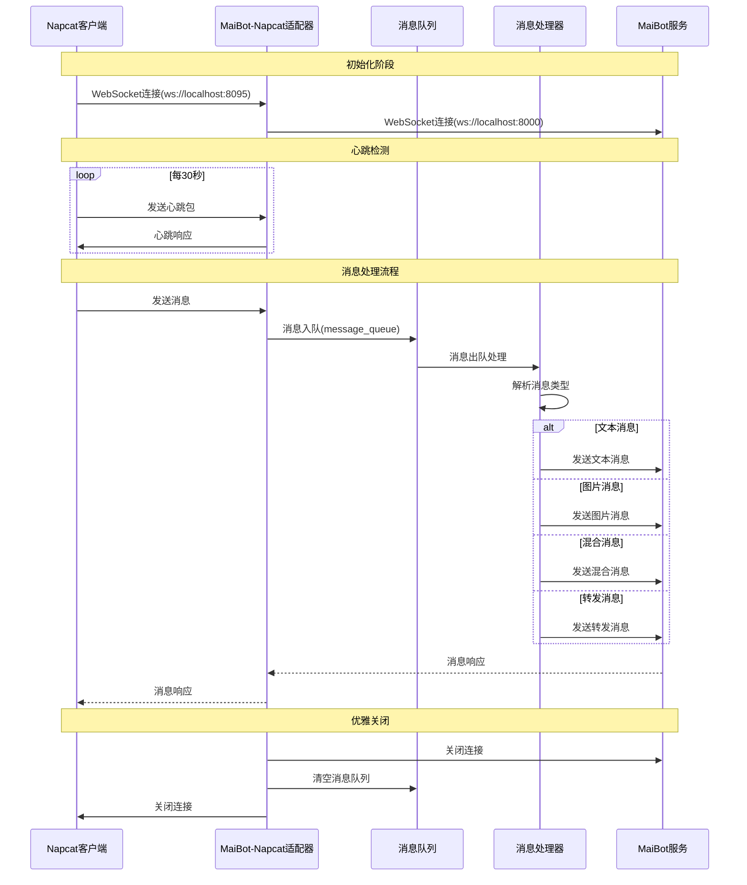

# MaiBot 与 Napcat 的 Adapter
运行方式：独立/放在MaiBot本体作为插件

# 使用说明
首先，napcat开**websocket客户端**，设置URL为类似这样：`ws://localhost:8095`

然后说明一下配置文件：

```
[Nickname] # 现在没用
nickname = ""

[Napcat_Server] # Napcat连接的ws服务设置
host = "localhost" # Napcat设定的url地址
port = 8095        # Napcat设定的ws端口

[MaiBot_Server] # 连接麦麦的ws服务设置
platform_name = "qq" # 标识adapter的名称（必填）
host = "localhost"   # 麦麦在.env文件中设置的url地址
port = 8000          # 麦麦在.env文件中设置的ws端口

[Napcat]
heartbeat = 30 # 与Napcat设置的心跳相同（按秒计）

[Whitelist] # 白名单功能（未启用）（未实现）
group_list = []
private_list = []
enable_temp = false

[Debug]
level = "INFO" # 日志等级（DEBUG, INFO, WARNING, ERROR）
```

你需要的就是把template_config.toml复制到根目录，然后改

至于requirements，需要maim_message，安装略

# 消息流转过程




# TO DO List
- [x] 读取自动心跳测试连接
- [x] 接受消息解析
  - [x] 文本解析
  - [x] 图片解析
  - [x] 文本与消息混合解析
  - [x] 转发解析（含图片动态解析）
  - [ ] 群公告解析
  - [x] 回复解析
  - [ ] 群临时消息（可能不做）
  - [ ] 链接解析
  - [x] 戳一戳解析
    - [x] 读取戳一戳的自定义内容
  - [ ] 语音解析（？）
  - [ ] 所有的notice类
    - [ ] <del>撤回</del>
- [x] 发送消息
  - [x] 发送文本
  - [x] 发送图片
  - [x] 发送表情包
  - [ ] 引用回复（完成但是没测试）
  - [ ] 戳回去（？）
  - [ ] 发送语音（？）
- [ ] 使用优先队列保证消息顺序（问题：对转发消息等napcat本身就是乱序的，处理速度不同如何解决）

  # 特别鸣谢
  特别感谢[@Maple127667](https://github.com/Maple127667)对本项目代码思路的支持