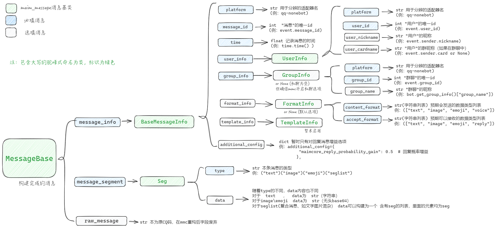

# Maim Message

一个用于定义maimcore消息通用接口的Python库。

## 安装

```bash
git clone https://github.com/MaiM-with-u/maim_message
cd maim_message
pip install -e .
```

## 使用方法

```python
from maim_message import MessageBase
```

## 介绍
maim_message是从maimbot项目衍生出来的各个组件之间的消息定义和交换的库，为了实现多平台和方便开发者开发，maimbot从与nonebot耦合发展到maimcore阶段，maimcore只暴露自己的websocket接口，别的组件可以通过maim_message提供的MessageClient类与maimcore连接，也可以构造MessageServer接受MessageClient连接。

在这种通信协议下，可以产生多种组件类型，例如最简单的nonebot_adapter与maimcore之间的通信，nonebot作为MessageClient，连接作为MessageServer的maimcore，从而实现一个消息客户端的开发。另外还支持类似代理或中间件的插件形式，例如让nonebot连接到插件的MessageServer，插件再通过MessageClient连接到maimcore。

消息的构造使用MessageBase，MessageBase提供了序列化和反序列化的方法，是消息通信的基本格式，使用时可以直接构造MessageBase，也可以继承MessageBase后构造。

消息的基本内容由maim_message的Seg定义，Seg有type和data两个属性，除了特殊类型seglist之外，type并无限制，但maimcore只能处理类型为text，image，emoji，seglist的Seg，Seg支持嵌套，seglist类型的Seg的data定义为一个Seg列表，便于含有多种类型组合的消息，以及含有嵌套的消息可以直接递归的解析成Seg。

目前maimcore可以处理的Seg类型以及定义如下:
```python
Seg(
        "seglist",
        [
            Seg("text", "111(raw text)"),
            Seg("emoji", "base64(无头base64)"),
            Seg("image", "base64(无头base64)"),
        ],
    )
```

## 构造一个合法消息  
#### 消息构造一图流


#### 消息构造代码参考  
```python
from maim_message import (
    BaseMessageInfo,
    UserInfo,
    GroupInfo,
    FormatInfo,
    TemplateInfo,
    MessageBase,
    Seg
)
import asyncio


def construct_message(platform):
    # 构造消息
    user_info = UserInfo(
        # 必填
        platform=platform,
        user_id='12348765',
        # 选填
        user_nickname="maimai",
        user_cardname="mai god",
    )

    group_info = GroupInfo(
        # 必填
        platform=platform,  # platform请务必保持一致
        group_id='12345678',
        # 选填
        group_name="aaabbb",
    )

    format_info = FormatInfo(
        # 消息内容中包含的Seg的type列表
        content_format=["text", "image", "emoji", "at", "reply", "voice"],
        # 消息发出后，期望最终的消息中包含的消息类型，可以帮助某些plugin判断是否向消息中添加某些消息类型
        accept_format=["text", "image", "emoji", "reply"],
    )

    # 暂时不启用，可置None
    template_info_custom = TemplateInfo(
        template_items={
            "detailed_text": "[{user_nickname}({user_nickname})]{user_cardname}: {processed_text}",
            "main_prompt_template": "...",
        },
        template_name="qq123_default",
        template_default=False,
    )

    template_info_default = TemplateInfo(template_default=True)

    message_info = BaseMessageInfo(
        # 必填
        platform=platform,
        message_id="12345678",  # 只会在reply和撤回消息等功能下启用，且可以不保证unique
        time=1234567.001,  # 时间戳
        group_info=group_info,
        user_info=user_info,
        # 选填和暂未启用
        format_info=format_info,
        template_info=None,
        additional_config={
            "maimcore_reply_probability_gain": 0.5  # 回复概率增益
        },
    )

    message_segment = Seg(
        "seglist",
        [
            Seg("text", "111(raw text)"),
            Seg("emoji", "base64(raw base64)"),
            Seg("image", "base64(raw base64)"),
            Seg("at", "111222333(qq number)"),
            Seg("reply", "123456(message id)"),
            Seg("voice", "wip"),
        ],
    )

    raw_message = "可有可无"

    message = MessageBase(
        # 必填
        message_info=message_info,
        message_segment=message_segment,
        # 选填
        raw_message=raw_message,
    )
    return message
```

## 简要构造一个消息客户端
涉及到标准消息的构建与客户端的建立，maim_message提供了一个Router类，可用于管理一个客户端程序处理多种不同平台的数据时建立的多个MessageClient，可参考如下。


```python
from maim_message import (
    Router,
    RouteConfig,
    TargetConfig,
)

# 配置路由config 
# 从RouteConfig类构建route_config实例
route_config = RouteConfig( 
    #根据TargetConfig类构建一个合法的route_config
    route_config={
        "platform1": TargetConfig( 
            url="ws://127.0.0.1:19000/ws",
            token=None,  # 如果需要token验证则在这里设置
        ),
        # 可配置多个平台连接
        "platform2": TargetConfig(
            url="ws://127.0.0.1:19000/ws",
            token="your_auth_token_here",  # 示例：带认证token的连接 
        ),
        "platform3": TargetConfig(
            url="ws://127.0.0.1:19000/ws",
            token=None, 
        ),
    }
)

# 使用刚刚构建的route_config,从类Router创建路由器实例router
router = Router(route_config)


async def main():
    # 使用实例router的方法注册消息处理器
    router.register_class_handler(message_handler) #message_handler示例见下方

    try:
        # 启动路由器（会自动连接所有配置的平台）
        router_task = asyncio.create_task(router.run())

        # 等待连接建立
        await asyncio.sleep(2)

        # 使用router.send_message()方法发送消息
        await router.send_message(construct_message("test"))#接受的参数为MessageBase

        # 保持运行直到被中断
        await router_task

    finally:
        print("正在关闭连接...")
        await router.stop()
        print("已关闭所有连接")

async def message_handler(message):
    """
    一个作为示例的消息处理函数
    从mmc发来的消息将会进入此函数
    你需要解析消息，并且向指定平台捏造合适的消息发送
    如将mmc的MessageBase消息转换为onebotV11协议消息发送到QQ
    或者根据其他协议发送到其他平台
    """
    print(f"收到消息: {message}")


if __name__ == "__main__":
    try:
        asyncio.run(main())
    except KeyboardInterrupt:
        pass  # 让asyncio.run处理清理工作

```


## 构造一个maimcore plugin
实际上只是模仿了maimcore的结构，真正的plugins应该继续向下游发送消息。
```python
from maim_message import MessageBase, Seg, MessageServer


async def process_seg(seg: Seg):
    """处理消息段的递归函数"""
    if seg.type == "seglist":
        seglist = seg.data
        for single_seg in seglist:
            await process_seg(single_seg)
    # 实际内容处理逻辑
    if seg.type == "voice":
        seg.type = "text"
        seg.data = "[音频]"
    elif seg.type == "at":
        seg.type = "text"
        seg.data = "[@某人]"


async def handle_message(message_data):
    """消息处理函数"""
    message = MessageBase.from_dict(message_data)
    await process_seg(message.message_segment)

    # 将处理后的消息广播给所有连接的客户端
    await server.send_message(message)


if __name__ == "__main__":
    # 创建服务器实例
    server = MessageServer(host="0.0.0.0", port=19000)

    # 注册消息处理器
    server.register_message_handler(handle_message)

    # 运行服务器
    server.run_sync()

```


## 许可证

MIT
